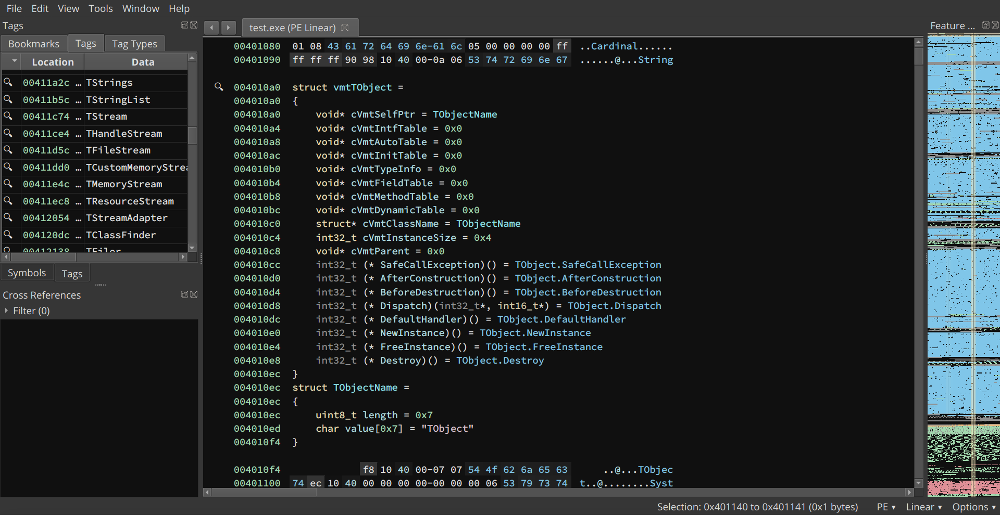

# Delphi VMT Analyzer (v0.1.2)

Author: **ImNotAVirus**

_Find Delphi VMTs and generate their structures_

## Description:

This plugin is intended to facilitate the revese engineering of binaries written in Delphi.

For that, it:

- Finds the Virtual Method Table (VMT) of Delphi classes
- Creates a structure for each VMT (class name, instance size, virtual methods, etc...)
- Creates a tag for each VMT in order to locate them more easily

**Warning**: This plugin currently only supports 32bits PE (Portable Executable). For more details on upcoming features, you can refer to [TODO.md](./TODO.md).

## Installation Instructions

### Darwin

No special instructions, package manager is recommended

### Windows

No special instructions, package manager is recommended

### Linux

No special instructions, package manager is recommended

## Examples

This repo contains different examples to show how the plugin works in scripting mode.  
You can view them [here](./examples).

**Warning**: although DelphiNinja does not require dependencies, some examples may require dependencies.  
For more information, please refer to this [page](./examples/README.md).

## Minimum Version

This plugin has been tested with the following minimum version of Binary Ninja:

* release: N/A
* dev: 2440

## License

This plugin is released under a MIT license.

## Metadata Version

2
