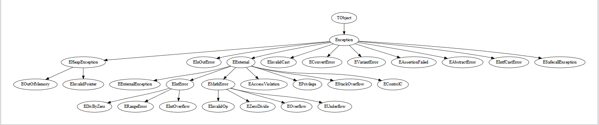

# Examples

## list_vmts.py

**Description**:

A simple script displaying all VMTs found for a Delphi binary.  
It displays, for each VMT, its start address as well as the size of the instances of its class.

**Dependencies**:

- N/A

**Usage**:

    > python3 examples/list_vmts.py
    Usage: examples/list_vmts.py <file_name> <delphi_version>

    > python3 examples/list_vmts.py binary.exe 7
    <DelphiNinja> [13:37:42.724] [InfoLog] File loaded
    <DelphiNinja> [13:37:42.724] [InfoLog] -----------------------------        
    <DelphiNinja> [13:37:42.725] [InfoLog] Searching for VMT...
    <DelphiNinja> [13:37:42.730] [InfoLog] <TObject start=0x00401058 instance_size=0x4>
    <DelphiNinja> [13:37:42.763] [InfoLog] <Exception start=0x00404F20 instance_size=0xC>
    <DelphiNinja> [13:37:42.764] [InfoLog] <EHeapException start=0x00404F88 instance_size=0x10>    
    <DelphiNinja> [13:37:42.765] [InfoLog] <EOutOfMemory start=0x00404FE4 instance_size=0x10>      
    <DelphiNinja> [13:37:42.765] [InfoLog] <EInOutError start=0x00405040 instance_size=0x10>       
    <DelphiNinja> [13:37:42.766] [InfoLog] <EExternal start=0x00405098 instance_size=0x10>
    <DelphiNinja> [13:37:42.766] [InfoLog] <EExternalException start=0x004050F0 instance_size=0x10>
    <DelphiNinja> [13:37:42.767] [InfoLog] <EIntError start=0x00405150 instance_size=0x10>
    <DelphiNinja> [13:37:42.767] [InfoLog] <EDivByZero start=0x004051A8 instance_size=0x10>        
    <DelphiNinja> [13:37:42.768] [InfoLog] <ERangeError start=0x00405200 instance_size=0x10>       
    <DelphiNinja> [13:37:42.775] [InfoLog] <EIntOverflow start=0x00405258 instance_size=0x10>
    <DelphiNinja> [13:37:42.781] [InfoLog] <EMathError start=0x004052B4 instance_size=0x10>
    <DelphiNinja> [13:37:42.782] [InfoLog] <EInvalidOp start=0x0040530C instance_size=0x10>
    <DelphiNinja> [13:37:42.786] [InfoLog] <EZeroDivide start=0x00405364 instance_size=0x10>
    <DelphiNinja> [13:37:42.812] [InfoLog] <EOverflow start=0x004053BC instance_size=0x10>
    <DelphiNinja> [13:37:42.820] [InfoLog] <EUnderflow start=0x00405414 instance_size=0x10>
    <DelphiNinja> [13:37:42.822] [InfoLog] <EInvalidPointer start=0x0040546C instance_size=0x10>
    <DelphiNinja> [13:37:42.824] [InfoLog] <EInvalidCast start=0x004054C8 instance_size=0xC>
    <DelphiNinja> [13:37:42.842] [InfoLog] <EConvertError start=0x00405524 instance_size=0xC>
    <DelphiNinja> [13:37:42.843] [InfoLog] <EAccessViolation start=0x00405580 instance_size=0x10>
    <DelphiNinja> [13:37:42.844] [InfoLog] <EPrivilege start=0x004055E0 instance_size=0x10>
    <DelphiNinja> [13:37:42.845] [InfoLog] <EStackOverflow start=0x00405638 instance_size=0x10>
    <DelphiNinja> [13:37:42.846] [InfoLog] <EControlC start=0x00405694 instance_size=0x10>
    <DelphiNinja> [13:37:42.847] [InfoLog] <EVariantError start=0x004056EC instance_size=0xC>
    <DelphiNinja> [13:37:42.848] [InfoLog] <EAssertionFailed start=0x00405748 instance_size=0xC>
    <DelphiNinja> [13:37:42.849] [InfoLog] <EAbstractError start=0x004057A8 instance_size=0xC>
    <DelphiNinja> [13:37:42.851] [InfoLog] <EIntfCastError start=0x00405804 instance_size=0xC>
    <DelphiNinja> [13:37:42.868] [InfoLog] <ESafecallException start=0x00405860 instance_size=0xC>

## vmt_visualizer.py

**Description**:

A script to graphically represent the inheritance of all classes for a Delphi binary.

**Dependencies**:

- pip install graphviz
- Graphviz binaries ([https://graphviz.org/download/](https://graphviz.org/download/#executable-packages))

**Usage**:

    > python3 examples/vmt_visualizer.py
    Usage: examples/vmt_visualizer.py <file_name> <delphi_version>

    > python3 examples/vmt_visualizer.py binary.exe 7

## create_vmt_struct.py

**Description**:

This script finds the VMTs of a binary, creates the corresponding structures and saves them in a Binary Ninja (`.bndb`) database.  
It's the equivalent of the `DelphiNinja\Analyze current binary` command in graphical mode.

**Dependencies**:

- N/A

**Usage**:

    > python3 examples/create_vmt_structs.py
    Usage: examples/create_vmt_structs.py <file_name> <delphi_version>

    > python3 examples/create_vmt_structs.py binary.exe 7
    [...]
    <DelphiNinja> [13:37:42.089] [InfoLog] Saving database: `binary.exe.bndb`...

